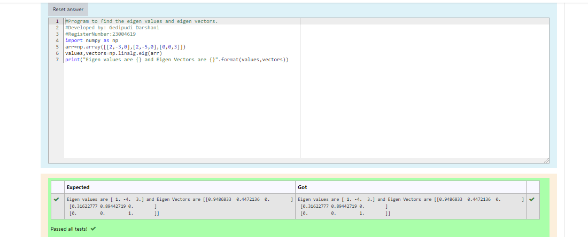

# EIGENVALUES-AND-EIGENVECTORS
## Aim:
To write a python program to find the Eigenvalues and Eigen Vectors
## Equipment’s required:
1. 	Hardware – PCs
2. 	Anaconda – Python 3.7 Installation / Moodle-Code Runner
## Algorithm:
### Step1 : 
Import the numby module to use the built-in functions for calculation
### Step 2: 
prepare the lists from the given matrix and assign in np.array()
### Step 3:
Using the np.linalg.eig(),  we get two results (first is eigenvalue and second is eigenvector) of the given matrix.
### Step 4: 
End the program

## Program:
``````
#program to find the eigen values and eigen vectors.
#Developed by: Gedipudi Darshani
#RegisterNumber:23004619
import numpy as np
arr=np.array([[2,-3,0],[2,-5,0],[0,0,3]])
values,vectors=np.linalg.eig(arr)
print("Eigen values are {} and Eigen Vectors are {}".format(values,vectors))
``````
## Output:

## Result:
Thus the Eigenvalue and Eigenvector is successfully solved using python programming.
